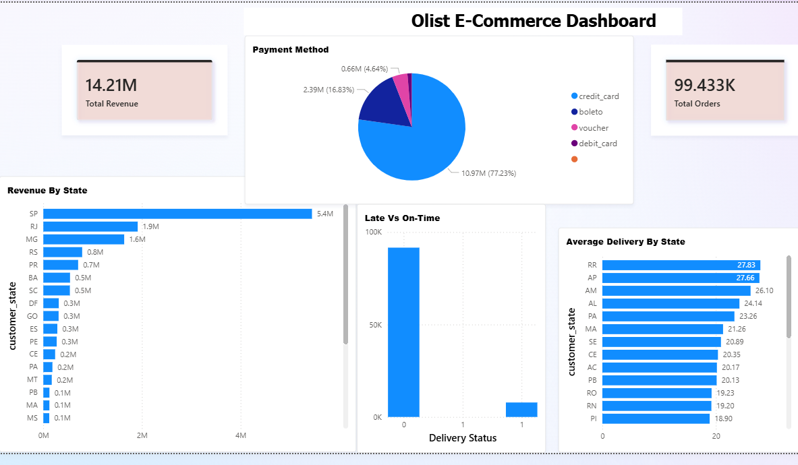

# Olist E-Commerce Analysis

## Overview
An end-to-end data analytics project on the Brazilian Olist 
e-commerce dataset analyzing customer behavior, sales performance, 
and delivery patterns.

## Dataset
Olist Brazilian E-Commerce Dataset from Kaggle
- 5 CSV files merged into one master dataset
- 100,000+ orders from 2016 to 2018

## Tools Used
- Python, Pandas, NumPy
- Matplotlib, Seaborn
- Scikit-learn, XGBoost
- Power BI

## Project Structure
- Data Cleaning & Feature Engineering
- Exploratory Data Analysis (EDA)
- Machine Learning Models
- Power BI Dashboard

## ML Models Built
| Model | Task | Result |
|---|---|---|
| Linear Regression | Predict delivery days | R2 = 0.05 |
| Logistic Regression | Predict late delivery | Accuracy = 95% |
| XGBoost | Predict late delivery | Accuracy = 96% |

 ## Dashboard Preview

## Key Insights
- São Paulo generates highest revenue among all states
- Credit card is preferred by 77% of customers
- Remote states pay higher freight costs
- XGBoost detects late deliveries better than Logistic Regression